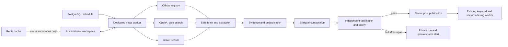

# Weekly AI model-news publisher implementation blueprint

Status: confirmed and implemented for the local Docker release on 2026-09-14. The schedule remains administrator-controlled and disabled by default.

Last updated: 2026-09-14.

## Outcome

MAblog will run a durable weekly research pipeline for the non-interactive `MABlog_IA` publisher. It will discover model releases from verified first-party sources and broad web search, create one English-and-Spanish public roundup, verify every factual claim against retained evidence, and publish only after every configured gate passes. Site administrators will manage the feature from `/admin/ai-news`.

The first release remains local and Docker-first. Production deployment, hosted secret management, and infrastructure scaling remain later work.

## Delivery architecture



- PostgreSQL owns schedules, runs, jobs, leases, checkpoints, evidence, editions, costs, alerts, and audit history.
- A new `news-worker` Docker service processes only AI-news jobs. The existing `worker` continues to index approved post passages.
- Redis may cache public and administrator status summaries. The application remains correct when Redis is unavailable.
- FastAPI owns authorization and all mutations. Next.js renders the administrator workspace and localized public content without receiving provider secrets.

## Additive storage model

One versioned migration will back up and extend the existing schema without replacing human-authored post data.

| Record | Purpose and important constraints |
| --- | --- |
| `users` additions | Add explicit `is_admin` and `is_system` flags. Only the bootstrapped `MABlog_IA` row is a system identity; no login session can be issued for it. |
| `admin_step_ups` | Store a hashed, session-bound, ten-minute authorization after password and email-code verification. Never store the code or password. |
| `admin_audit_events` | Append-only actor, action, target, reason, timestamp, and bounded before/after metadata for role, source, schedule, publication, and correction changes. |
| `post_localizations` | Store `en` and `es` structured documents under one canonical post, with a shared revision and atomic publication boundary. Existing human posts continue using their current document format. |
| `automated_editions` | Link a canonical post or private preview to its news run, verification state, source count, last-verified time, correction note, and public disclosure data. |
| `news_settings` | Store schedule enabled state, timezone, next run, successful-scan cursor, activation-preview result, and configurable budget values. A deployment kill switch remains outside the database. |
| `news_sources` | Store provider, endpoint kind, canonical URL, activation state, validation result, and audit metadata for the official registry. |
| `news_source_suggestions` | Store inactive providers and endpoints discovered on the web until an administrator reviews them. |
| `news_runs` | Store run kind, window, state, stage, progress, budget totals, warnings, preview/publication intent, lease information, and terminal outcome. |
| `news_jobs` | Store one idempotent leased stage job, checkpoint, attempts, next retry time, and bounded redacted error. |
| `news_candidates` | Store normalized provider/model/version/update identity, canonical URLs, classification, deduplication result, and prior-edition link. |
| `news_documents` | Store safe source metadata, hash, format, bounded cleaned content, 30-day snapshot expiry, and fetch warnings. |
| `news_claims` | Store each claim, language-neutral identity, exact evidence excerpts and source references, and supported/contradicted/unsupported verification status. |
| `news_alerts` | Store one deduplicated action-required alert per run and type plus per-administrator read state and email outcome. |
| `news_usage` | Store provider/model/stage usage and estimated cost without request secrets or hidden model reasoning. |
| `news_source_checks` | Store the 30-day post-publication hash checks and any resulting reverification outcome. |

Database constraints and transaction locks will enforce one active run, one waiting scheduled request, one localization per language, immutable system identity rules, idempotent publication, and protection of the final active administrator.

## Durable pipeline

The worker will checkpoint these stages and retry only the failed transient stage after approximately one, five, and twenty minutes, while honoring a longer provider `Retry-After` value:

1. **Readiness:** require OpenAI, report Brave and email degradation, enforce the per-run and monthly limits, and acquire the one-run lease.
2. **Schedule and source monitoring:** calculate the normal or catch-up window, deduplicate a pending schedule, and hash-check cited sources still inside their 30-day monitoring window.
3. **Official discovery:** scan active sources for the seeded core providers.
4. **Broad discovery:** merge OpenAI Responses web-search and Brave Search candidates, retaining provider failures as coverage warnings.
5. **Safe retrieval:** allow public HTTPS only, revalidate DNS and every redirect, honor `robots.txt`, identify the crawler, and enforce the agreed redirect, timeout, size, port, and media-type limits.
6. **Extraction:** parse public HTML, PDF, Markdown, and plain text into bounded untrusted excerpts after removing active, hidden, and instruction-like content.
7. **Classification and deduplication:** identify meaningful lifecycle updates and compare canonical URLs, hashes, provider/model/version/type identity, and earlier evidence.
8. **Evidence mapping:** use `gpt-5.6-luna` to build strict structured claim/evidence records. A first-party source must establish every release.
9. **Composition:** use `gpt-5.6-terra` to create synchronized English and Spanish structured block trees, detailed tags, accessible alternative text, and the locally rendered branded cover.
10. **Independent verification:** use a separate `gpt-5.6-terra` call with only the editions and evidence. Every claim must be supported and both languages must remain consistent.
11. **Repair and safety:** repair only failing sections up to two times, then run deterministic secret, personal-data, link, markup, quotation, and moderation checks.
12. **Preview or publication:** retain a private preview or atomically create/update the localized public post, covered-release records, scan cursor, evidence, disclosure, and indexing job.
13. **Notification and retention:** create deduplicated administrator alerts, deliver permitted emails, remove expired snapshots and diagnostics, and retain the agreed permanent audit records.

A quiet scheduled run advances the scan cursor without publishing. A catch-up produces one compressed roundup and may shorten release sections below the normal minimum while keeping every qualifying update and every verification requirement.

## Backend module boundaries

The implementation will preserve the small FastAPI composition root and split the feature by responsibility:

```text
backend/app/
  api/
    ai_news/
      router.py
      dashboard.py
      runs.py
      sources.py
      editions.py
      notifications.py
    administrators.py
  services/
    administration.py
    admin_audit.py
    step_up.py
    ai_news/
      readiness.py
      scheduler.py
      state_machine.py
      registry.py
      discovery.py
      safe_fetch.py
      extraction.py
      classification.py
      deduplication.py
      evidence.py
      composition.py
      verification.py
      safety.py
      cover.py
      publication.py
      monitoring.py
      retention.py
      notifications.py
      usage.py
      providers/
        openai.py
        brave.py
  news_worker.py
```

SQLAlchemy records remain in `models.py`, request/response validation remains in `schemas.py`, and environment-backed values remain in `config.py`, as required by the current project architecture. Each function and route will have a purpose docstring; difficult security, transaction, retry, ranking, and retention rules will have nearby intent comments and named configuration values.

## API surface

- `/api/admin/administrators`: list, promote, and remove administrators with final-administrator protection.
- `/api/admin/step-up/*`: request and complete recent password-and-email verification.
- `/api/admin/ai-news/status`: readiness, schedule, budget, active progress, recent outcomes, and alerts.
- `/api/admin/ai-news/runs`: history and one detailed run with stages, costs, candidates, evidence, verification, warnings, and preview.
- `/api/admin/ai-news/runs/preview`: start a normal or up-to-30-day historical private preview.
- `/api/admin/ai-news/runs/publish`: publish a verified preview after current source and duplicate checks.
- `/api/admin/ai-news/runs/run-and-publish`: explicitly start the fully gated immediate path.
- `/api/admin/ai-news/schedule`: enable after a complete activation preview, disable, and show the next run.
- `/api/admin/ai-news/sources`: test, add, edit, disable, and reactivate official sources.
- `/api/admin/ai-news/suggestions`: review or dismiss discovered provider suggestions.
- `/api/admin/ai-news/editions`: unpublish, start a corrected revision, accept synchronized text, verify, and republish.
- `/api/admin/ai-news/notifications`: list, mark read, and update the administrator's email preference.
- Public post/profile responses will add localized content and the bounded automated-authorship disclosure without revealing private run data.

All administrator checks will be enforced in the backend. Frontend visibility is convenience, never authorization.

## Frontend module boundaries

The administrator interface will use shadcn/ui, Tailwind CSS, the existing language system, and a feature-scoped Zustand store for active run state and filters. Each independently understandable component and effect will have its own file.

```text
frontend/src/features/admin/
  administrators/
    administrator-page.tsx
    administrator-table.tsx
    role-dialog.tsx
  ai-news/
    ai-news-page.tsx
    ai-news-overview.tsx
    readiness-panel.tsx
    schedule-card.tsx
    budget-card.tsx
    run-list.tsx
    run-detail.tsx
    run-progress.tsx
    candidate-table.tsx
    evidence-panel.tsx
    verification-panel.tsx
    preview-reader.tsx
    source-registry.tsx
    source-dialog.tsx
    suggestion-list.tsx
    correction-editor.tsx
    notification-list.tsx
    step-up-dialog.tsx
    ai-news-store.ts
    use-run-polling.ts
    use-ai-news-actions.ts
```

Reusable public pieces will live beside the post features: an automated-authorship badge, correction note, localized edition reader, responsive automated block renderers, and the one-card carousel limiter. Focused styles will remain separate from component logic and will support keyboard navigation, reduced motion, screen readers, desktop, and phone layouts.

## Docker and configuration

- Add a `news-worker` service built from `backend/`, with the same database and secret environment as the API but a separate process command.
- Keep PostgreSQL, Redis, Mailpit, backend, indexing worker, frontend, uploads, and persistent volumes separate.
- Add named environment settings for the master schedule switch, Monday time and timezone, model tiers, Brave endpoint/key, run/month/query budgets, fetch limits, worker poll/lease/retry times, crawler identity, retention periods, and local-only step-up bypass.
- Refuse any production configuration that enables the local authentication bypass or uses the default development application secret.
- Redact provider values and errors before persistence, API responses, and logs.

## Implementation milestones

- [x] **I33 - Back up state and add administrator/system identity schema.** Created a consistent pre-migration backup, applied additive Alembic revision 0004, retained the local administrator, and seeded the protected no-login `MABlog_IA` identity.
- [x] **I34 - Add administrator authorization, step-up verification, and audit history.** Enforced administrator checks and recent password/email-code step-up on protected mutations, added audit records, and protected the last active administrator.
- [x] **I35 - Add AI-news records, configuration, readiness, and the core registry.** Added durable settings, registry, runs, jobs, evidence, editions, revisions, alerts, usage, source checks, readiness reporting, and verified provider seeds.
- [x] **I36 - Implement safe fetching and supported document extraction.** Added strict public-HTTPS validation, DNS/IP and redirect checks, bounded fetches, robots handling, supported extractors, untrusted-content treatment, hashing, and snapshot expiry.
- [x] **I37 - Implement hybrid discovery, classification, and update-aware deduplication.** Added OpenAI and optional Brave discovery, official-registry fallback, evidence-backed lifecycle classification, inactive source suggestions, and update-aware duplicate handling.
- [x] **I38 - Implement evidence, bilingual composition, verification, repair, and safety.** Added Luna/Terra stages, exact evidence catalogs, synchronized typed documents, claim verification, two bounded repairs, structural repair rejection, moderation, and deterministic publication gates.
- [x] **I39 - Implement the durable news worker and scheduler.** Added the dedicated Compose worker, PostgreSQL leases/checkpoints, retry delays, one active run, one collapsed catch-up, budgets, idempotency, quiet runs, restart recovery, and master kill switch.
- [x] **I40 - Publish localized structured editions and index them.** Added atomic bilingual publication, branded covers, disclosures, corrections, unpublish-retain behavior, 30-day source monitoring, tiered retention, and durable search indexing.
- [x] **I41 - Build the administrator and AI-news workspaces.** Added focused bilingual components for readiness, schedule, budget, runs, evidence, previews, source registry, revisions, alerts, and protected administrator roles.
- [x] **I42 - Integrate public reading, search, profile, and carousel behavior.** Added locale-selected typed reading, search indexing, system profile presentation, verification metadata, and the one-AI-card carousel limit.
- [x] **I43 - Verify locally and activate through a real preview.** Preserved existing data, rebuilt all affected Docker services, passed backend/browser/static checks, exercised failed-stage recovery, and completed a real 30-day historical private preview with bilingual verification and safety gates. The preview created no post, recorded activation proof, and left the schedule disabled for administrator choice.
- [x] **I44 - Complete local operations and progress documentation.** Documented configuration, provider setup, readiness, backup/restore, checkpoint recovery, costs, activation, unpublication, corrections, retention, and future production gaps.

Each completed milestone will be added to `docs/build-progress.md` with the affected areas and actual verification. No milestone will be marked complete before its implementation and appropriate checks succeed.

## Activation contract

Automated scheduling starts disabled. The activation preview must use a real qualifying first-party release and pass the complete live pipeline in both languages within the configured budget. A quiet preview does not count; an administrator may select a historical window of up to 30 days. After success, an administrator uses step-up authorization to enable Monday 09:00 `Europe/Madrid` scheduling.

Engineering tests will still be written for security boundaries, state transitions, and failure recovery because those are necessary to implement the system safely. In accordance with the chosen product rule, the application itself gates schedule activation only on the real successful preview, not on a stored automated-test result.

## Confirmation record

The user explicitly confirmed this blueprint on 2026-09-14. Implementation proceeded through I33-I44 without changing the accepted publication or administrator authority. Schedule activation remains a separate administrator action after a complete qualifying preview.
